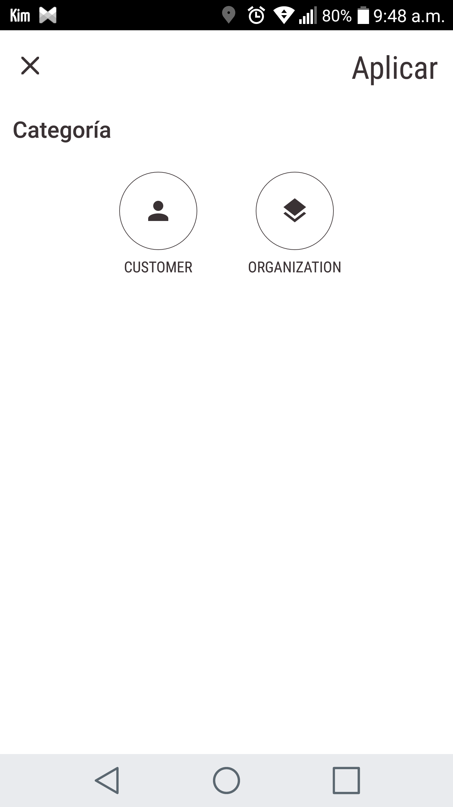
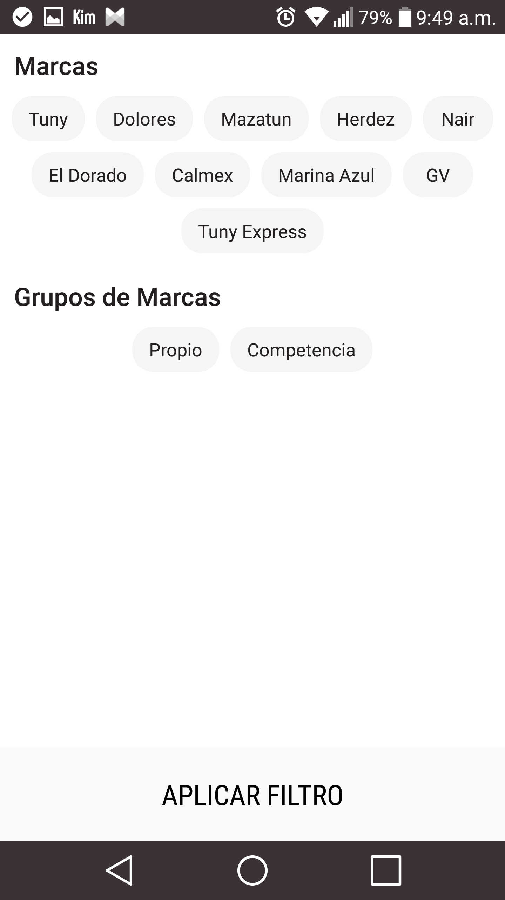

# Android FilterView
[](https://jitpack.io/#FranciscoJavierPRamos/Android-FilterView)

Build a simple filter view with customizable controls.

<p align="center">
  
  
</p>


# Download from Gradle

1. Add it in your root build.gradle at the end of repositories:
```
allprojects {
  repositories {
    ...
    maven { url 'https://jitpack.io' }
    }
} 
```
2. Add the dependency
``` 	
dependencies {
  compile 'com.github.FranciscoJavierPRamos:Android-FilterView:1.0.4'
}
```

# Usage

* Create a section
```java
SingleSection singleSection = new SingleSection.Builder("Category", 1)
                .setSectionNameColor(R.color.colorAccent)
                .addOption(new SingleOption("CUSTOMER", R.color.colorAccent,
                        R.drawable.ic_account_black_24dp, R.color.colorBackground,
                        R.color.colorAccent, 2, R.color.colorAccent))
                .addOption(new SingleOption("ORGANIZATION", R.color.colorAccent,
                        R.drawable.ic_layers_black_24dp, R.color.colorBackground,
                        R.color.colorAccent, 2, R.color.colorAccent))
                .build().setOnSingleOptionListener(new OnSingleOptionListener() {
                    @Override
                    public void onClick(SingleOption option) {

                    }
                });
```

* Create FilterView instance and add section 
``` java
new FilterView.Builder(this)
                .withTitle("Aplicar")
                .setToolbarVisible(true)
                .withTitleColor(R.color.colorAccent)
                .withDivisorColor(R.color.colorAccent)
                .setCloseIconColor(R.color.colorAccent)
                .addSection(singleSection)
                .build()
                .setOnFilterViewResultListener(new OnFilterViewResultListener() {
                    @Override
                    public void onResult(JSONArray data) {
                        System.out.println(data.toString());
                    }
                }).show();
```
Call to ```show(); ``` method to display FilterView and ```setOnFilterViewResultListener(...) ``` to return JSONArray with data filtered.

# Sections

* SingleSection with SingleOption control.
* SliderSection with SliderOption control.
* TagSection with String tags.
* ExtraSection with:
  * ExtraBoolean
  * ExtraCurrencyEditText
  * ExtraDate
  * ExtraHSM
  * ExtraList
  * ExtraEditText
  

# License

```java Copyright [yyyy] [name of copyright owner]

Licensed under the Apache License, Version 2.0 (the "License");
you may not use this file except in compliance with the License.
You may obtain a copy of the License at

    http://www.apache.org/licenses/LICENSE-2.0

Unless required by applicable law or agreed to in writing, software
distributed under the License is distributed on an "AS IS" BASIS,
WITHOUT WARRANTIES OR CONDITIONS OF ANY KIND, either express or implied.
See the License for the specific language governing permissions and
limitations under the License.```
